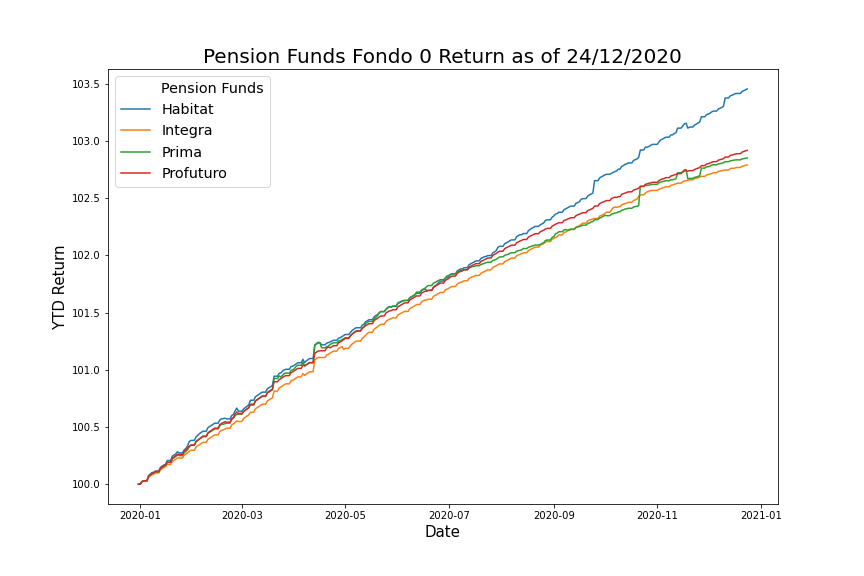
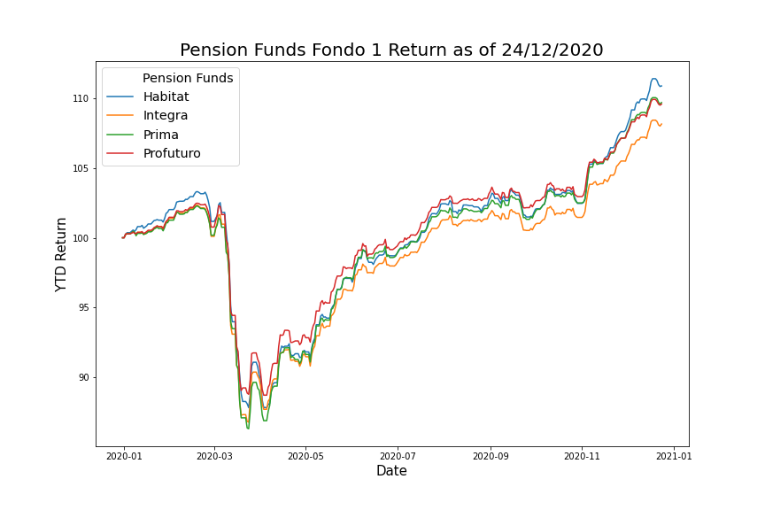
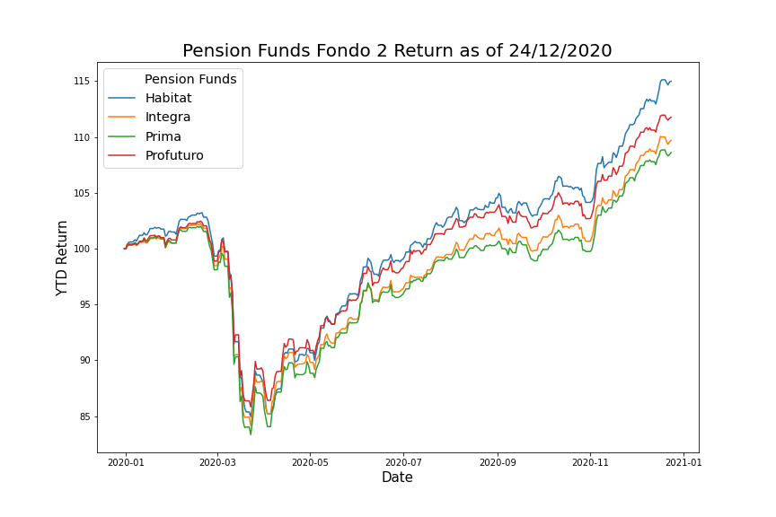
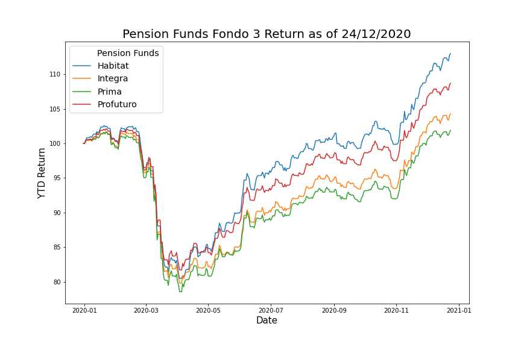

# Scraping SBS (Superintendencia de Banca, Seguros y AFPs) Website

## Overview

The aim of the script is to automate the daily information retrieval from the SBS (Peruvian Financial Regulator) website (https://www.sbs.gob.pe/), to compare and follow over time the Pension Funds returns and Asset Under Management (AUM).

## Contents
* VC-AFPs.csv
* SBS-scraping.py
* descriptive-stats.ipynb

## Information Retrieved
* **NAV**: The Net Asset Value for all the Subfunds (Fondo 0, Fondo 1, Fondo 2 and Fondo 3) of all the Peruvian Private Pension Funds (Habitat, Integra, Prima and Profuturo)
* **AUM**: Total Asset Under Management in Peruvian Soles (PEN) for all the Subfunds of all the Peruvian Private Pension Funds.
* **Number of Shares**: Total number of shares of each AFP Subfund (this number can increase or decrease based on contributions or redemptions)

## YTD Returns (Assuming a $ 100 investment the first day of the current year)

### Fondo 0 Returns

### Fondo 1 Returns

### Fondo 2 Returns

### Fondo 3 Returns

## Steps to automate the information retrieval
* Clone this repository.
* Run from terminal the SBS-scraping.py script.
* Once the script is executed, the csv file will be updated to the most recent date. It can now be imported to any data analysis software (Power BI, Tableau, Excel). The README.md file will also be updated with the most recent charts. 
* It is possible to schedule execution of the script from Windows Task Scheduler.
